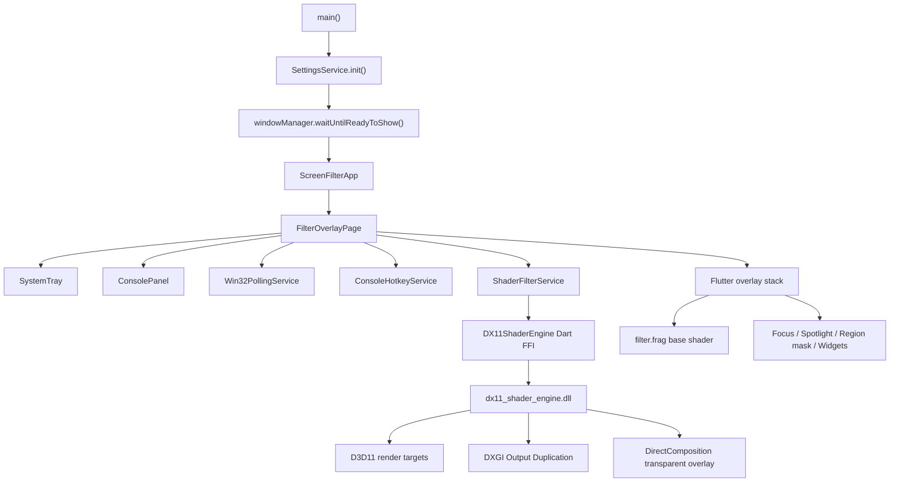

# ScreenFilter 技术说明

更新日期：2026-06-13

## 1. 项目定位

ScreenFilter 是一个 Windows-only 的桌面屏幕滤镜应用。应用主体使用 Flutter 构建，窗口层通过 `window_manager` 创建全屏、透明、置顶、默认鼠标穿透的覆盖窗口；动态滤镜和屏幕后处理通过 `native/dx11_shader_engine` 原生 DX11 动态库渲染，并通过 Dart FFI 接入 Flutter。

项目目标是提供一个常驻托盘的屏幕覆盖工具，支持：

- 基础色彩滤镜：颜色、透明度、亮度、最近颜色和预设。
- 顶层组件：时钟、标语、水印。
- 高级模式：专注模式、聚光灯、区域遮罩、进程自动化、全局控制台快捷键。
- Shader 沙盒：HLSL 编辑、预览、`.shader` 导入导出、静态/动态全屏应用。
- 屏幕特效：HLSL 叠加效果，以及基于桌面截图纹理的 native 马赛克后处理。
- 系统托盘快捷控制、配置持久化、配置导入导出和开机启动控制。

当前仓库只维护 Windows 桌面版本。非 Windows 平台目录已从仓库中移除。

## 2. 运行时架构



核心状态集中在 `FilterOverlayPage`：

- 启动时从 `SettingsService` 读取基础滤镜、组件、高级配置、自动化规则、快捷键和最近 native 滤镜状态。
- 初始化 `Win32PollingService`，按需提供鼠标、前台窗口矩形和前台进程名。
- 初始化 `ShaderFilterService`，加载 native DLL，初始化 DX11 device，并同步透明度、亮度、区域遮罩和后处理状态。
- 初始化系统托盘，左键打开/关闭控制面板，右键刷新并弹出快捷菜单。
- 初始化 `ConsoleHotkeyService`，通过 Windows runner 的 MethodChannel 注册或注销 Win32 全局热键。
- 维护 Flutter 基础滤镜、DX11 native 滤镜、顶层组件、高级功能、自动化和配置导入导出的协作关系。

## 3. 技术栈

| 层级 | 技术/依赖 | 作用 |
| --- | --- | --- |
| Flutter UI | Flutter Material、CustomPaint、FragmentShader | 控制台、基础滤镜、组件、遮罩编辑 UI |
| 窗口控制 | `window_manager` | 全屏透明窗口、置顶、隐藏任务栏、鼠标穿透切换 |
| 系统托盘 | `system_tray` | 托盘图标、右键菜单、面板/滤镜/聚光灯/快捷键控制 |
| 配置存储 | `shared_preferences` | 基础滤镜、高级配置、组件配置、自动化规则、最近 native 滤镜状态 |
| 文件选择 | `file_selector` | 配置导入导出、`.shader` 导入导出、水印图片选择 |
| FFI | `dart:ffi`、`ffi` | Dart 调用 `dx11_shader_engine.dll` |
| MethodChannel | Flutter Windows runner | Dart 请求注册全局热键，runner 接收 `WM_HOTKEY` 后回调 Dart |
| Native GPU | Direct3D 11、D3DCompiler、DXGI、DirectComposition | HLSL 编译、桌面截图采样、GPU 渲染、透明 native overlay |
| Win32 辅助 | `user32.dll`、`kernel32.dll`、PowerShell | 前台进程识别、鼠标位置、窗口矩形、启动项和字体探测 |

## 4. 目录结构

```text
lib/
  main.dart                         应用入口、窗口/托盘/全局状态、覆盖层组合
  models/
    advanced_config.dart            专注、聚光灯、遮罩、自动化、快捷键、导入导出模型
    filter_preset.dart              基础滤镜预设
    overlay_component.dart          时钟/标语/水印组件模型
    screen_effect.dart              HLSL 叠加屏幕特效
    screen_post_process_effect.dart native 后处理特效枚举
    shader_preset.dart              Shader 沙盒 .shader 文件模型和默认模板
  services/
    dx11_shader_ffi.dart            DX11 native DLL 的 Dart FFI 封装
    shader_filter_service.dart      shader 编译、渲染、native overlay、fallback 状态管理
    settings_service.dart           SharedPreferences 配置服务
    win32_helpers.dart              Win32 前台窗口/进程/鼠标工具
    win32_polling_service.dart      按消费者启停的 Win32 状态轮询服务
    console_hotkey_service.dart     全局控制台热键 Dart 侧服务
    automation_preset_controller.dart 前台进程预设切换与恢复逻辑
    tray_menu_layout.dart           托盘菜单纯数据布局
    tray_filter_memory.dart         托盘滤镜关闭/恢复记忆
    filter_overlay_logic.dart       覆盖层绘制与启动恢复纯逻辑
    debounced_action.dart           单通道防抖动作
    keyed_debounced_action.dart     按 key 防抖的设置持久化动作
  ui/
    console_panel.dart              主控制台面板
    advanced/advanced_page.dart     高级功能页
    sandbox/                        Shader 沙盒页面、编辑器和 uniform 控制
    overlays/                       时钟、标语、水印、专注、聚光灯、区域遮罩 UI
    color_picker/                   自定义颜色选择器
    widgets/                        数值输入、位置选择等复用控件

native/dx11_shader_engine/
  include/shader_engine.h           C ABI 导出接口
  src/shader_engine.cpp             DX11 设备、shader 编译、屏幕捕获、overlay、遮罩
  CMakeLists.txt                    原生 DLL 构建配置

windows/
  CMakeLists.txt                    Flutter Windows runner 与 native DLL 集成
  runner/flutter_window.*           Flutter host window 和全局热键 MethodChannel
  runner/win32_window.*             DPI-aware Win32 窗口封装

shaders/
  filter.frag                       Flutter 侧基础 Fragment Shader

test/
  *_test.dart                       纯逻辑、服务、组件和 native 集成约束测试
```

## 5. 启动流程与状态恢复

启动入口在 `main.dart`：

1. `WidgetsFlutterBinding.ensureInitialized()` 和 `windowManager.ensureInitialized()` 初始化 Flutter 与窗口插件。
2. `SettingsService.init()` 读取 `SharedPreferences`。
3. 通过 `WindowOptions` 创建透明、置顶、隐藏标题栏、跳过任务栏的窗口。
4. `waitUntilReadyToShow()` 中设置全屏、显示窗口并打开鼠标穿透。
5. `ScreenFilterApp` 根据持久化字体构建主题，进入 `FilterOverlayPage`。

`FilterOverlayPage.initState()` 会加载：

- 基础滤镜：亮度、透明度、基础色、最近颜色、当前预设。
- 顶层组件：时钟、标语、水印。
- 高级功能：专注、聚光灯、区域遮罩、自动化规则、快捷键配置。
- 最近 native 滤镜状态：`filter_last_native_overlay`。

最近 native 滤镜恢复用于应用重启后恢复 DX11 overlay：

1. 若存在 `PersistedNativeFilterState`，`shouldPrimeNativeRestoreOnStartup()` 使启动阶段进入恢复准备状态。
2. 启动恢复期间会临时抑制基础 shader 和顶层组件，避免 Flutter 首帧与 native overlay 叠加闪烁。
3. 对普通 HLSL 滤镜，先重新编译持久化的 `shaderCode`；对马赛克后处理，不要求存在用户 shader。
4. `_clearFlutterSurfaceBeforeNativeRestore()` 先绘制透明 surface，再调用 `ShaderFilterService.applyFilter()`。
5. 恢复成功后保持面板关闭并恢复鼠标穿透；恢复失败时打开控制台供用户处理，并清理无效 native 状态。

`filter_last_native_overlay` 是运行时恢复状态，不属于 `AppConfig` 导入导出的用户配置快照。

## 6. 窗口模型与覆盖层结构

### 6.1 Windows Flutter 窗口

Flutter 主窗口具备以下特性：

- `backgroundColor: Colors.transparent`：透明窗口背景。
- `skipTaskbar: true`：不出现在任务栏。
- `titleBarStyle: TitleBarStyle.hidden`：隐藏标题栏。
- `alwaysOnTop: true`：置顶。
- `setFullScreen(true)`：覆盖整个屏幕。
- `setIgnoreMouseEvents(true)`：默认鼠标穿透，不影响用户操作桌面。

当控制面板打开时，`_togglePanel()` 会关闭鼠标穿透；面板关闭时恢复鼠标穿透。

### 6.2 Flutter 覆盖层顺序

`FilterOverlayPage.build()` 使用全屏 `Stack`：

1. 滤镜层：
   - `RegionMaskClipper`
   - Flutter 基础 `FragmentShader`
   - DX11 fallback `RawImage`
2. 专注模式覆盖层：`FocusModeOverlay`
3. 聚光灯覆盖层：`SpotlightOverlay`
4. 顶层组件：`ClockOverlay`、`SloganOverlay`、`WatermarkOverlay`
5. 控制台：`ConsolePanel`
6. 区域遮罩绘制层：`RegionMaskDrawingOverlay`

当 native overlay 活跃时，顶层组件会被隐藏，因为 native overlay 与 Flutter 主窗口是两条独立窗口/合成路径；控制台仍由 Flutter 主窗口绘制。

## 7. 滤镜渲染管线

项目有三类渲染路径：

- Flutter 基础滤镜路径。
- DX11 用户 HLSL / HLSL 屏幕特效路径。
- DX11 桌面截图后处理路径，目前包含马赛克。

### 7.1 Flutter 基础滤镜路径

基础滤镜使用 `shaders/filter.frag`：

- `uSize`：屏幕逻辑尺寸。
- `uBrightness`：亮度，负值变暗，正值变亮。
- `uAlpha`：整体透明度。
- `uBaseColor`：基础色。

`main.dart` 中 `_buildShaderFilter()` 设置这些 uniform，并通过 `ShaderPainter` 绘制全屏矩形。

`filter_overlay_logic.dart` 将基础 shader 是否绘制、是否清空透明 surface、native 恢复期间是否抑制图层抽成纯函数，方便测试启动恢复和关闭滤镜时的边界行为。

当 `ShaderFilterService.mode != FilterApplyMode.none` 时，Flutter 基础 shader 层通常跳过绘制，避免与 DX11 native overlay 或 fallback 叠加。

### 7.2 ShaderFilterService

`ShaderFilterService` 是 Dart 侧的 native 滤镜协调层，负责：

- 加载并初始化 `DX11ShaderEngine`。
- 分离编译 fullscreen shader 和 sandbox preview shader。
- 管理渲染模式：`none`、`static`、`dynamic`。
- 记录滤镜来源：`none`、`sandbox`、`screenEffect`。
- 管理后处理状态：`ScreenPostProcessEffect.none` / `mosaic`。
- 维护屏幕逻辑尺寸、DPI、鼠标位置、强调色、透明度和亮度。
- 将区域遮罩配置转换为物理像素坐标，并上传到 native。
- 优先使用 native overlay，失败时回退到 CPU readback + Flutter `RawImage`。

渲染尺寸使用物理像素：

```text
physicalWidth = round(logicalWidth * devicePixelRatio)
physicalHeight = round(logicalHeight * devicePixelRatio)
```

这样 DX11 render target 能匹配真实屏幕像素，避免高 DPI/4K 下滤镜发糊。

### 7.3 渲染模式与计时器

| 模式 | 行为 |
| --- | --- |
| `none` | 停止计时器、停止鼠标轮询、隐藏 native overlay、释放 fallback 图像 |
| `static` | 渲染一帧并冻结 |
| `dynamic` | 使用约 33ms 的 Timer 连续渲染，约 30 FPS |

动态模式会通过 `Win32PollingService.retainCursorPolling()` 开启鼠标轮询；停止滤镜后释放该消费者。fallback 动态渲染另有 `fallbackFrameInterval`，默认约 66ms，用于降低 GPU readback 和 Flutter 图像上传压力。

### 7.4 Native overlay 优先策略

`applyFilter()` 会先尝试 `_tryStartNativeOverlay()`：

1. 检查 DX11 engine 是否 ready，以及当前是否有可渲染内容：已编译用户 shader 或非 `none` 后处理。
2. 计算物理像素尺寸。
3. 调用 `engine_set_filter_visuals()` 同步透明度和亮度。
4. 调用 `engine_set_post_process_effect()` 同步后处理状态。
5. 调用 `engine_set_region_mask()` 同步区域遮罩。
6. 调用 `engine_show_overlay()` 创建/显示原生透明 overlay。

之后每帧调用 `engine_render_overlay_frame()`。若 native overlay 渲染失败，则隐藏 overlay 并回退到：

1. `engine_render_frame()`
2. `engine_get_frame_pixels()`
3. Dart `decodeImageFromPixels()`
4. Flutter `RawImage`

fallback 路径用于兼容或异常场景，但在高分辨率动态滤镜下成本较高。

### 7.5 HLSL sandbox 与屏幕采样

Shader 沙盒有两条 native 编译路径：

- `engine_compile_preview_shader()`：只替换 preview shader，不影响当前全屏滤镜。
- `engine_compile_shader()`：替换 fullscreen shader，用于静态/动态全屏滤镜。

native 会在用户代码前注入屏幕采样 helper：

```hlsl
float4 SampleScreen(float2 uv, float2 offsetPx)
```

`offsetPx` 会在 native 侧限制最大采样半径。为了避免用户 shader 绕过沙盒访问任意 texture/sampler/register，native 编译前会做文本级校验，拒绝 `Texture2D`、`SamplerState`、`register(t*)`、`.Sample()` 等直接资源访问写法。用户应通过 `SampleScreen(uv, offsetPx)` 读取屏幕纹理。

屏幕纹理来源于 DXGI Output Duplication。native 会对 Flutter host window 和 native overlay 调用 `SetWindowDisplayAffinity(..., WDA_EXCLUDEFROMCAPTURE)`，避免截图纹理包含 ScreenFilter 自己，从而形成反馈循环。

preview 使用独立 preview render target、preview staging texture 和 preview pixel shader；当 fullscreen overlay 最近已经捕获过屏幕纹理时，preview 可复用近期纹理，降低重复捕获成本。

### 7.6 内置屏幕特效与马赛克

`models/screen_effect.dart` 中的 HLSL 叠加特效包括：

- 雪花
- 星星
- 萤火虫
- 极光
- 阳光

这些特效走用户 HLSL shader 路径，会先编译对应 HLSL，再以 `FilterApplyOrigin.screenEffect` 应用动态滤镜。

马赛克由 `ScreenPostProcessEffect.mosaic` 表示，不依赖用户 shader。Dart 侧调用：

```dart
applyFilter(
  FilterApplyMode.dynamic,
  screenSize,
  accentColor,
  postProcessEffect: ScreenPostProcessEffect.mosaic,
  postProcessIntensity: 24.0,
  origin: FilterApplyOrigin.screenEffect,
)
```

native 侧通过 `engine_set_post_process_effect(1, intensity)` 选择内置 mosaic pixel shader。该 shader 采样桌面截图纹理，并以 `intensity` 作为块大小。

## 8. DX11 native shader engine

原生模块位于 `native/dx11_shader_engine`，编译为 `dx11_shader_engine.dll`，并通过 Windows CMake install 规则复制到 Flutter 可执行文件旁边。

### 8.1 C ABI 导出接口

| 函数 | 作用 |
| --- | --- |
| `engine_init()` | 创建 DX11 device/context，编译全屏三角形 vertex shader、overlay compositor、mosaic 和 downsample shader |
| `engine_compile_shader()` | 编译用户 fullscreen HLSL pixel shader |
| `engine_compile_preview_shader()` | 编译 sandbox preview HLSL pixel shader，不替换 fullscreen shader |
| `engine_set_uniforms()` | 设置用户 shader uniform：时间、分辨率、鼠标、强调色 |
| `engine_render_frame()` | 渲染 fullscreen 用户 shader 到内部 render target |
| `engine_render_preview_frame()` | 渲染 preview shader 到独立 preview render target |
| `engine_get_frame_pixels()` | 从最近渲染的 fullscreen 或 preview staging texture 读取 RGBA 像素 |
| `engine_show_overlay()` | 创建/显示 native transparent overlay |
| `engine_render_overlay_frame()` | 渲染用户 shader 或后处理，并合成到 native overlay |
| `engine_set_filter_visuals()` | 设置 overlay compositor 的透明度和亮度 |
| `engine_set_post_process_effect()` | 选择 native 后处理特效，目前 `0=none`、`1=mosaic` |
| `engine_hide_overlay()` | 隐藏并释放 overlay 相关资源 |
| `engine_is_overlay_active()` | 查询 native overlay 是否处于可见状态 |
| `engine_set_region_mask()` | 上传区域遮罩多边形并生成 mask texture |
| `engine_shutdown()` | 释放 DX11、overlay、屏幕捕获和 shader 资源 |

Dart 侧 `DX11ShaderEngine` 必须与这些函数签名严格一致。

### 8.2 GPU 资源

native engine 维护几组核心资源：

- fullscreen render target：用户 shader 或后处理输出。
- fullscreen staging texture：CPU fallback readback。
- preview render target / preview staging：沙盒预览专用，避免覆盖 fullscreen 状态。
- screen texture / screen SRV：DXGI Output Duplication 捕获到的桌面帧。
- sandbox screen texture：为用户 shader 采样准备的降采样屏幕纹理。
- mask texture：区域遮罩的 R8 texture。
- DirectComposition swapchain：native 透明 overlay 的最终输出。

`engine_get_frame_pixels()` 根据 `g_lastFrameReadbackKind` 决定读取 fullscreen 还是 preview staging texture。

### 8.3 Native transparent overlay

native overlay 使用独立 Win32 窗口 + DirectComposition：

- overlay window class：`SCREEN_FILTER_DX11_OVERLAY_WINDOW`
- 扩展样式：
  - `WS_EX_TOOLWINDOW`
  - `WS_EX_TRANSPARENT`
  - `WS_EX_NOACTIVATE`
  - `WS_EX_NOREDIRECTIONBITMAP`
- 窗口过程 `WM_NCHITTEST` 返回 `HTTRANSPARENT`，保证鼠标穿透。
- 使用 `CreateSwapChainForComposition()` 创建 DirectComposition swapchain。
- swapchain alpha mode 为 `DXGI_ALPHA_MODE_PREMULTIPLIED`。
- overlay 在第一帧合成后再显示，减少空白/闪烁。
- 找到 Flutter host window 后，overlay 会被放在 Flutter 窗口之后，避免遮住控制台。
- overlay 会设置 `WDA_EXCLUDEFROMCAPTURE`，避免被 DXGI 捕获回自身纹理。

### 8.4 Overlay composite shader

native 内置 compositor 负责最终合成：

1. 从 `userFrame : register(t0)` 采样用户 shader 或后处理输出。
2. 根据 `u_Brightness` 调整 RGB。
3. 根据 `u_Opacity` 调整 alpha。
4. 如果区域遮罩启用，从 `maskFrame : register(t1)` 采样 mask。
5. 如启用反向遮罩，则使用 `1.0 - mask`。
6. 返回 premultiplied alpha 结果，满足 DirectComposition swapchain 要求。

透明度、亮度和区域遮罩都在 GPU 合成阶段统一生效。

### 8.5 区域遮罩实现

区域遮罩在 Dart 层存储为逻辑像素坐标：

```dart
RegionMaskConfig(
  enabled: true,
  inverted: false,
  regions: [MaskRegion(points: [...])]
)
```

同步到 native 时，`ShaderFilterService` 会：

1. 过滤未启用或点数少于 3 的区域。
2. 将每个点乘以 device pixel ratio，转换为物理像素。
3. 扁平化为 `[x0, y0, x1, y1, ...]`。
4. 传入每个区域的点数列表。
5. 生成 signature，若配置、尺寸、DPI、点位都未变化，则跳过上传。

native `engine_set_region_mask()` 会：

1. 校验参数。
2. 为 `width * height` 分配一张 `uint8_t` mask。
3. 对每个多边形计算 bounding box。
4. 使用 even-odd point-in-polygon 判断像素中心是否在多边形内。
5. 生成 `DXGI_FORMAT_R8_UNORM` immutable texture。
6. 创建 `g_maskSrv`，供 composite shader 采样。

遮罩栅格化是 CPU 操作，但只在遮罩配置、屏幕尺寸或 DPI 变化时发生；正常动态帧仍由 GPU 采样 mask texture。

## 9. 控制台、托盘与快捷键

### 9.1 ConsolePanel

`ConsolePanel` 是主要 UI 控制台，侧边菜单包括：

- 主页
- 滤镜
- 高级
- 沙盒
- 常规
- 关于

它负责：

- 基础滤镜参数调整、预设选择和最近颜色。
- 顶层组件启用、拖动、设置。
- HLSL 屏幕特效和马赛克后处理启停。
- Shader 沙盒入口。
- 高级页入口。
- 字体、开机启动和退出操作。

### 9.2 系统托盘

托盘布局由 `lib/services/tray_menu_layout.dart` 的纯数据模型描述：

```text
显示/隐藏面板
---
[ ] 滤镜
[ ] 聚光灯
[ ] 快捷键
---
常用预设
  护眼
  夜间
  清除滤镜
---
退出
```

抽成纯模型的原因：

- 菜单结构可以用普通 Flutter test 验证。
- UI/插件对象只作为最终适配层，避免测试依赖系统托盘插件。
- 后续增加菜单项时，可以先改布局测试，再接实际行为。

`TrayFilterMemory` 负责托盘滤镜开关的恢复体验：

- 关闭基础滤镜前，记录基础色、透明度和亮度。
- 关闭 native 滤镜前，记录模式、来源、强调色、透明度、亮度、shader code 或后处理状态。
- 再次打开滤镜时，优先恢复最近 native 滤镜，其次恢复基础滤镜，否则应用“护眼”预设。

### 9.3 全局控制台快捷键

快捷键配置模型为 `ConsoleHotkeyConfig`：

- `enabled`
- `presetId`

内置预设包括：

- `Ctrl + Alt + F`
- `Ctrl + Alt + S`
- `Ctrl + Shift + F`
- `Alt + F12`

Dart 侧 `ConsoleHotkeyService` 通过 MethodChannel `screen_filter_app/hotkey` 调用 runner：

- `registerHotkey`：传入 modifiers 和 keyCode。
- `unregisterHotkey`：注销当前热键。

Windows runner 在 `flutter_window.cpp` 中调用 Win32 `RegisterHotKey()`，收到 `WM_HOTKEY` 后通过同一 channel 发送 `hotkeyPressed`，Dart 侧再调用 `_togglePanel()`。

## 10. 高级功能

### 10.1 专注模式

`FocusModeOverlay` 基于前台窗口矩形绘制遮罩，让前台窗口区域保持可见，周围区域变暗。前台窗口矩形来自 `Win32PollingService.foregroundWindowRect`。

### 10.2 聚光灯

`SpotlightOverlay` 基于全局鼠标位置绘制圆形透明区域，其他区域变暗。鼠标位置来自 `Win32PollingService.cursorPosition`。

聚光灯通过托盘也可快速启停。托盘开启聚光灯时，如果专注模式正在开启，会关闭专注模式，保持两者互斥。

### 10.3 区域遮罩

区域遮罩支持绘制多个多边形区域，并支持反向模式：

- 非反向：滤镜仅作用于区域内。
- 反向：滤镜作用于区域外。

Flutter 基础滤镜通过 `RegionMaskClipper` 响应区域遮罩；DX11 native overlay 通过 `engine_set_region_mask()` 上传遮罩 texture。

### 10.4 自动化规则

自动化规则按前台进程 exe 名称精确匹配。`AutomationPresetController` 会在首次命中前保存当前基础滤镜快照，命中规则时应用对应预设；当自动化关闭、规则为空或当前进程不再匹配时，恢复之前的基础滤镜。

## 11. 配置与数据模型

### 11.1 SettingsService keys

| 分组 | key |
| --- | --- |
| 基础滤镜 | `filter_brightness`、`filter_alpha`、`filter_base_color`、`filter_active_preset`、`filter_recent_colors` |
| Native 恢复 | `filter_last_native_overlay` |
| 顶层组件 | `overlay_clock`、`overlay_slogan`、`overlay_watermark` |
| 常规设置 | `general_startup`、`general_theme`、`general_font` |
| 高级功能 | `advanced_focus_mode`、`advanced_spotlight`、`advanced_region_mask`、`advanced_automation_rules`、`advanced_automation_enabled`、`advanced_console_hotkey` |

复杂对象使用 `jsonEncode()` 存储为字符串。

### 11.2 AppConfig

`AppConfig` 是配置导入导出的快照，包含：

- 基础滤镜和最近颜色。
- 字体、开机启动、主题偏好。
- 自动化启用状态和规则。
- 控制台快捷键配置。
- 专注、聚光灯、区域遮罩配置。

`AppConfig.fromJson()` 对输入做保守解析：类型不匹配或解析失败时回退默认值，避免导入损坏配置导致应用崩溃。

### 11.3 ShaderPreset

`.shader` 文件是 JSON 格式，包含：

- format/version。
- metadata：名称、作者、描述、创建时间、标签。
- shader：语言和 HLSL 代码。
- uniforms：当前强调色。

默认 shader 模板展示 `Uniforms` cbuffer 和 `SampleScreen(uv, offsetPx)` 的用法。

## 12. Win32 轮询与自动化

`win32_helpers.dart` 通过 FFI 调用：

- `GetForegroundWindow`
- `GetWindowRect`
- `GetWindowThreadProcessId`
- `OpenProcess`
- `QueryFullProcessImageNameW`
- `CloseHandle`
- `GetCursorPos`

`Win32PollingService` 将这些采样封装成按消费者启停的 `ValueNotifier`：

- 鼠标位置：默认 16ms。
- 前台窗口矩形：默认 50ms。
- 前台进程名：默认 2s。

只有存在消费者时才启动对应轮询。多个功能共享同一个服务，避免每个 overlay 或自动化逻辑各自开 Timer。

## 13. 构建与产物

推荐环境：

- Windows 10/11。
- Flutter SDK，项目约束 `sdk: ^3.11.0`。
- Visual Studio 2022，安装 Desktop development with C++。
- Windows SDK。

获取依赖：

```powershell
flutter pub get
```

本地运行：

```powershell
flutter run -d windows
```

Release 构建：

```powershell
flutter build windows --release
```

构建产物默认位于：

```text
build/windows/x64/runner/Release/screen_filter_app.exe
```

`windows/CMakeLists.txt` 通过 `add_subdirectory()` 引入：

```cmake
add_subdirectory("${CMAKE_CURRENT_SOURCE_DIR}/../native/dx11_shader_engine"
                 "${CMAKE_CURRENT_BINARY_DIR}/dx11_shader_engine")
```

`native/dx11_shader_engine/CMakeLists.txt` 构建 `dx11_shader_engine` shared library，并链接：

- `d3d11`
- `d3dcompiler`
- `dcomp`
- `dxgi`

install 规则会将 DLL 安装到 Flutter 可执行文件旁边，使 `DX11ShaderEngine.load()` 能通过：

```dart
final exeDir = File(Platform.resolvedExecutable).parent.path;
DynamicLibrary.open('$exeDir/dx11_shader_engine.dll');
```

加载 native DLL。

## 14. 测试

当前测试集中在可单测的业务边界和 native 集成约束：

- `shader_filter_service_test.dart`：物理像素尺寸、视觉参数 clamp、native overlay 重绘、区域遮罩上传、马赛克无需用户 shader、fallback 节流、fallback image 释放、sandbox preview/fullscreen 分离。
- `tray_menu_layout_test.dart`：托盘菜单结构、状态反映、托盘滤镜记忆。
- `filter_overlay_logic_test.dart`：基础 shader 绘制/清空、native 启动恢复、顶层组件与 native overlay 互斥。
- `console_hotkey_service_test.dart`：MethodChannel 注册/注销热键参数。
- `win32_polling_service_test.dart`：按消费者启停的 Win32 轮询。
- `native_overlay_position_test.dart`：native overlay 定位、首次呈现后显示、捕获排除、preview 资源分离。
- `native_shader_sandbox_test.dart`：`SampleScreen` 注入、sandbox 资源访问限制。
- `settings_service_test.dart`：配置持久化、最近 native 滤镜状态、导入容错。
- `advanced_page_test.dart`、`console_panel_screen_effect_test.dart`、`config_import_notifier_test.dart` 等组件与导入同步测试。

推荐验证命令：

```powershell
flutter test
flutter build windows --release
```

对 native/DX11 改动，至少应跑 Windows release 构建，因为它会编译 native DLL 并验证 CMake 集成。

## 15. 扩展指南

### 15.1 增加基础滤镜预设

修改 `lib/models/filter_preset.dart`：

1. 在 `kBasicFilterPresets` 中新增 `FilterPreset`。
2. 设置 `baseColor`、`alpha`、`brightness`。
3. 如需托盘常用入口，更新 `tray_menu_layout.dart` 和对应测试。

### 15.2 增加 HLSL 叠加屏幕特效

修改 `lib/models/screen_effect.dart`：

1. 新增 HLSL 字符串，复用 `_kHeader`。
2. 保持 `main(PS_INPUT input) : SV_TARGET` 入口。
3. 在 `kScreenEffects` 中新增 `ScreenEffect`。
4. 确认 shader 使用的 uniform 不超出现有 `Uniforms` cbuffer。
5. 为 `ConsolePanel` 中的启停/高亮行为补测试。

### 15.3 增加 native 后处理特效

新增 native 后处理需要同步：

1. `lib/models/screen_post_process_effect.dart`：新增枚举值。
2. `lib/services/dx11_shader_ffi.dart`：确保 effect index 与 native 约定一致。
3. `native/dx11_shader_engine/include/shader_engine.h`：更新 `engine_set_post_process_effect()` 注释。
4. `native/dx11_shader_engine/src/shader_engine.cpp`：编译新内置 shader，扩展 `engine_set_post_process_effect()` 和 `RenderPostProcessToTarget()`。
5. `ConsolePanel`：增加入口、默认透明度/亮度和高亮状态。
6. 测试：覆盖不依赖用户 shader 的启动路径、native effect index 和 UI 启停行为。

### 15.4 增加 native FFI 接口

新增 native 接口需要同步三处：

1. `native/dx11_shader_engine/include/shader_engine.h`：声明 C ABI。
2. `native/dx11_shader_engine/src/shader_engine.cpp`：实现导出函数。
3. `lib/services/dx11_shader_ffi.dart`：新增 C/Dart typedef、lookup、Dart 方法。

注意事项：

- C ABI 尽量只传基本类型、指针和长度。
- Dart FFI 分配的 native memory 必须在 `finally` 中释放。
- HLSL cbuffer 结构体需要满足 16 字节对齐。
- 修改 native 后必须跑 Windows build。

### 15.5 扩展区域遮罩

当前遮罩是多边形 -> CPU 栅格化 -> R8 GPU texture。若要支持更多形状：

- Dart 层可以继续传 flattened point list，或新增 shape type。
- native 层可以增加 rasterization 分支。
- 若遮罩频繁动态变化，应考虑 GPU 生成 mask，避免每帧 CPU 栅格化。

### 15.6 增加托盘菜单项

推荐流程：

1. 先修改 `test/tray_menu_layout_test.dart`，写出期望菜单结构。
2. 修改 `lib/services/tray_menu_layout.dart`。
3. 在 `main.dart` 的 `_handleTrayAction()` 中接入行为。
4. 如果菜单项反映状态，扩展 `TrayMenuState`。

托盘菜单应保持简洁，适合作为快捷入口；复杂配置继续放在 `ConsolePanel` 或 `AdvancedPage`。

## 16. 性能要点

1. 4K/高 DPI 下，动态 shader 应优先走 native overlay。
2. CPU fallback 会进行 GPU readback 和 Flutter 图像上传，只适合兼容/异常路径。
3. fallback 动态帧有节流，避免在 native overlay 不可用时过度占用 CPU/GPU。
4. 区域遮罩只在配置、尺寸或 DPI 变化时上传，正常帧只在 GPU 中采样。
5. DXGI Output Duplication 捕获桌面纹理时要避免捕获自身窗口，因此依赖 `WDA_EXCLUDEFROMCAPTURE`。
6. native overlay 使用 DirectComposition，减少 Flutter 合成压力。
7. 动态模式 Timer 约 30 FPS；若未来需要更平滑动画，可考虑 vsync/高精度调度，但要评估功耗。
8. `engine_set_filter_visuals()` 只更新 compositor uniform，不重新编译 shader。
9. overlay swapchain 仅在尺寸变化时重建，避免打开控制台等场景频繁重建窗口或闪烁。

## 17. 已知边界与注意事项

- 项目当前仅支持 Windows。
- DX11 dynamic shader 使用 HLSL，不是 Flutter GLSL runtime effect。
- Flutter 基础滤镜和 DX11 shader 滤镜不是同一条渲染链路；两者通过主状态互斥/协调。
- native overlay 是独立透明窗口，聚光灯/专注模式等 Flutter 覆盖层仍由 Flutter 主窗口绘制。
- 当 native overlay 活跃时，顶层组件会隐藏，以避免窗口层级冲突。
- 若 native overlay 创建失败，系统会回退到 Flutter `RawImage` 路径，但高分辨率下性能较差。
- 区域遮罩 native 化后可作用于 DX11 overlay；Flutter 基础滤镜仍通过 `RegionMaskClipper` 响应区域遮罩。
- 自动化按 exe 文件名精确匹配，不做窗口标题、路径或通配匹配。
- 开机启动相关逻辑通过 HKCU Run 注册表项处理，部署环境需要允许相关 PowerShell/注册表操作。

## 18. 维护建议

- 对 UI 状态、托盘菜单、启动恢复这类逻辑，优先抽成纯 Dart 函数或模型并写 Flutter test。
- 对 native 接口改动，保持 header、Dart typedef、实现三处同步。
- 对性能相关改动，优先检查是否引入 GPU readback、CPU per-frame rasterization、频繁屏幕捕获或频繁重建 swapchain。
- 对配置模型改动，要同步 `AppConfig`、`SettingsService`、导入通知和测试。
- 对高 DPI 相关改动，确认逻辑像素和物理像素边界，尤其是鼠标坐标、区域遮罩和 render target 尺寸。
