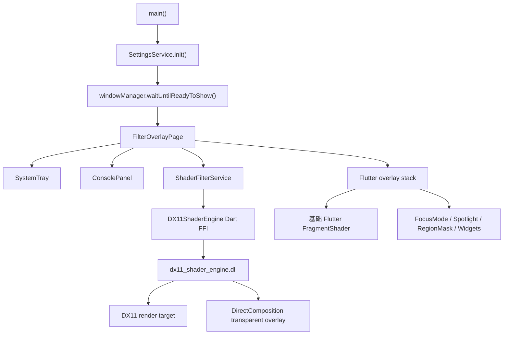

# ScreenFilter 技术说明

生成日期：2026-05-31

## 1. 项目定位

ScreenFilter 是一个 Windows-only 的桌面屏幕滤镜应用。应用主体使用 Flutter 构建，窗口层通过 `window_manager` 创建全屏、透明、置顶、默认鼠标穿透的覆盖窗口；高性能动态滤镜通过 `native/dx11_shader_engine` 原生 DX11 动态库渲染，并通过 Dart FFI 接入 Flutter。

项目目标是提供一个常驻托盘的屏幕覆盖工具，支持：

- 基础色彩滤镜：颜色、透明度、亮度。
- 预设滤镜：护眼、夜间、电影、电子书等。
- 顶层组件：时钟、标语、水印。
- 高级模式：专注模式、聚光灯、区域遮罩、进程自动化。
- Shader 沙盒与内置屏幕特效：使用 HLSL/DX11 渲染动态效果。
- 系统托盘快捷控制和配置持久化。

当前仓库只维护 Windows 桌面版本。非 Windows 平台目录已从仓库中移除。

## 2. 技术栈

| 层级 | 技术/依赖 | 作用 |
| --- | --- | --- |
| Flutter UI | Flutter Material、CustomPaint、FragmentShader | 控制面板、基础滤镜、顶层组件、遮罩编辑 UI |
| 窗口控制 | `window_manager` | 全屏透明窗口、置顶、隐藏任务栏、鼠标穿透切换 |
| 系统托盘 | `system_tray` | 托盘图标、右键菜单、面板开关、快捷滤镜控制 |
| 配置存储 | `shared_preferences` | 基础滤镜、高级配置、组件配置、自动化规则 |
| 文件选择 | `file_selector` | 配置导入导出、水印图片选择等 |
| FFI | `dart:ffi`、`ffi` | Dart 调用 `dx11_shader_engine.dll` |
| Native GPU | Direct3D 11、D3DCompiler、DXGI、DirectComposition | HLSL 编译、GPU 渲染、透明 native overlay |
| Win32 辅助 | `user32.dll`、`kernel32.dll` FFI | 前台进程识别、鼠标位置、窗口矩形 |

## 3. 目录结构

```text
lib/
  main.dart                         应用入口、窗口/托盘/全局状态、覆盖层组合
  models/
    advanced_config.dart            专注模式、聚光灯、区域遮罩、自动化、导入导出模型
    filter_preset.dart              基础滤镜预设
    overlay_component.dart          时钟/标语/水印组件模型
    screen_effect.dart              内置 HLSL 屏幕特效
    shader_preset.dart              Shader 沙盒预设模型
  services/
    dx11_shader_ffi.dart            DX11 native DLL 的 Dart FFI 封装
    settings_service.dart           SharedPreferences 配置服务
    shader_filter_service.dart      Shader 编译、渲染、native overlay 状态管理
    tray_menu_layout.dart           托盘菜单的纯数据布局
    win32_helpers.dart              Win32 前台窗口/进程/鼠标工具
  ui/
    console_panel.dart              主控制台面板
    advanced/advanced_page.dart     高级功能页
    sandbox/                        Shader 沙盒页面与编辑器
    overlays/                       时钟、标语、水印、专注、聚光灯、区域遮罩 UI

native/dx11_shader_engine/
  include/shader_engine.h           C ABI 导出接口
  src/shader_engine.cpp             DX11 设备、shader 编译、overlay 合成、区域遮罩
  CMakeLists.txt                    原生 DLL 构建配置

windows/
  CMakeLists.txt                    Flutter Windows runner 与 native DLL 集成
  runner/                           Windows runner 工程

shaders/
  filter.frag                       Flutter 侧基础 Fragment Shader

test/
  shader_filter_service_test.dart   ShaderFilterService 行为测试
  tray_menu_layout_test.dart        托盘菜单布局测试
```

## 4. 运行时整体架构



核心状态集中在 `FilterOverlayPage`：

- 启动时从 `SettingsService` 读取持久化配置。
- 初始化 `ShaderFilterService`，加载 native DLL 并初始化 DX11 设备。
- 初始化系统托盘，左键打开/关闭控制面板，右键显示快捷菜单。
- 加载 `shaders/filter.frag` 作为 Flutter 基础滤镜。
- 维护基础滤镜、顶层组件、高级功能、自动化规则等全局状态。

## 5. 窗口模型与覆盖层结构

### 5.1 Windows Flutter 窗口

`main.dart` 中通过 `window_manager` 创建窗口：

- `backgroundColor: Colors.transparent`：透明窗口背景。
- `skipTaskbar: true`：不出现在任务栏。
- `titleBarStyle: TitleBarStyle.hidden`：隐藏标题栏。
- `alwaysOnTop: true`：置顶。
- `setFullScreen(true)`：覆盖整个屏幕。
- `setIgnoreMouseEvents(true)`：默认鼠标穿透，不影响用户操作桌面。

当控制面板打开时，`_togglePanel()` 会调用：

- 打开面板：`setIgnoreMouseEvents(false)`，允许用户操作控制台和拖动组件。
- 关闭面板：`setIgnoreMouseEvents(true)`，恢复鼠标穿透。

### 5.2 Flutter 覆盖层顺序

`FilterOverlayPage.build()` 使用一个全屏 `Stack` 组织渲染层：

1. 滤镜层：
   - `RegionMaskClipper`
   - Flutter 基础 `FragmentShader`
   - DX11 CPU fallback 的 `RawImage`
2. 专注模式覆盖层：`FocusModeOverlay`
3. 聚光灯覆盖层：`SpotlightOverlay`
4. 顶层组件：`ClockOverlay`、`SloganOverlay`、`WatermarkOverlay`
5. 控制台：`ConsolePanel`
6. 区域遮罩绘制层：`RegionMaskDrawingOverlay`

注意：当 DX11 native overlay 可用时，动态 shader 滤镜会由原生 DirectComposition 透明覆盖窗口呈现；Flutter 中的 `RawImage` fallback 会保持为空。基础 Flutter 滤镜与专注/聚光灯/组件仍在 Flutter 主覆盖窗口中绘制。

## 6. 滤镜渲染管线

项目有两条滤镜渲染路径：Flutter 基础滤镜路径和 DX11/HLSL 路径。

### 6.1 Flutter 基础滤镜路径

基础滤镜使用 `shaders/filter.frag`：

- uniform `uSize`：屏幕逻辑尺寸。
- uniform `uBrightness`：亮度，负值变暗，正值变亮。
- uniform `uAlpha`：整体透明度。
- uniform `uBaseColor`：基础色。

`main.dart` 中 `_buildShaderFilter()` 设置这些 uniform，并通过 `CustomPaint` 的 `ShaderPainter` 绘制全屏矩形。

当 `ShaderFilterService.mode != FilterApplyMode.none` 时，Flutter 基础 shader 层会直接返回空控件，避免和 DX11 动态滤镜重叠。

### 6.2 DX11/HLSL 动态滤镜路径

DX11 路径由三部分组成：

1. `ShaderFilterService`
2. `DX11ShaderEngine` Dart FFI 封装
3. `dx11_shader_engine.dll`

#### 6.2.1 ShaderFilterService 职责

`ShaderFilterService` 是 Dart 侧的状态协调层，负责：

- 加载并初始化 native DX11 engine。
- 编译 HLSL shader。
- 管理渲染模式：`none`、`static`、`dynamic`。
- 维护当前屏幕尺寸、DPI、鼠标位置、强调色。
- 将透明度、亮度同步到 native compositor。
- 将区域遮罩配置转换为物理像素坐标，并上传到 native。
- 优先使用 native overlay；失败时回退到 CPU 读回 + Flutter `RawImage`。

渲染尺寸通过 `filterRenderSize` 计算：

```text
physicalWidth = round(logicalWidth * devicePixelRatio)
physicalHeight = round(logicalHeight * devicePixelRatio)
```

这样 DX11 渲染目标能匹配真实屏幕像素，避免高 DPI/4K 下滤镜发糊。

#### 6.2.2 渲染模式

| 模式 | 说明 |
| --- | --- |
| `none` | 不渲染滤镜，隐藏 native overlay，清空 fallback 图像 |
| `static` | 渲染一帧并冻结 |
| `dynamic` | 使用约 33ms 的 Timer 持续渲染，约 30 FPS |

Shader 沙盒页面会调用 `pauseOwnTimer()`，由沙盒自己推送帧；页面退出时再通过 `resumeOwnTimerIfNeeded()` 恢复 service 自身计时器。

#### 6.2.3 native overlay 优先策略

`applyFilter()` 会先尝试 `_tryStartNativeOverlay()`：

1. 检查 DX11 engine 是否 ready、shader 是否已编译。
2. 计算物理像素尺寸。
3. 调用 `engine_set_filter_visuals()` 同步透明度和亮度。
4. 调用 `engine_set_region_mask()` 同步区域遮罩。
5. 调用 `engine_show_overlay()` 创建/显示原生透明 overlay。

之后每帧调用 `engine_render_overlay_frame()`，由 native 直接渲染到 DirectComposition overlay。若 native overlay 渲染失败，则隐藏 overlay 并回退到：

1. `engine_render_frame()`
2. `engine_get_frame_pixels()`
3. Dart `decodeImageFromPixels()`
4. Flutter `RawImage`

这条 fallback 路径用于兼容或异常场景，但在 4K 动态滤镜下性能成本较高，因为它涉及 GPU -> CPU -> Flutter 图像上传。

## 7. DX11 native shader engine

原生模块位于 `native/dx11_shader_engine`，编译为 `dx11_shader_engine.dll`，并通过 Windows CMake install 规则复制到 Flutter 可执行文件旁边。

### 7.1 C ABI 导出接口

`include/shader_engine.h` 暴露了稳定的 C ABI：

| 函数 | 作用 |
| --- | --- |
| `engine_init()` | 创建 DX11 device/context，编译全屏三角形 vertex shader 和 overlay composite shader |
| `engine_compile_shader()` | 编译用户 HLSL pixel shader |
| `engine_set_uniforms()` | 设置用户 shader uniform：时间、分辨率、鼠标、强调色 |
| `engine_render_frame()` | 渲染用户 shader 到内部 render target |
| `engine_get_frame_pixels()` | 从 staging texture 读取 RGBA 像素，供 Flutter fallback 使用 |
| `engine_show_overlay()` | 创建/显示 native transparent overlay |
| `engine_render_overlay_frame()` | 渲染用户 shader 并合成到 native overlay |
| `engine_set_filter_visuals()` | 设置 overlay compositor 的透明度和亮度 |
| `engine_hide_overlay()` | 隐藏并释放 overlay 相关资源 |
| `engine_is_overlay_active()` | 查询 native overlay 是否处于可见状态 |
| `engine_set_region_mask()` | 上传区域遮罩多边形并生成 mask texture |
| `engine_shutdown()` | 释放 DX11 与 overlay 资源 |

Dart 侧 `DX11ShaderEngine` 必须与这些函数的签名严格一致。

### 7.2 用户 HLSL shader 约定

内置屏幕特效与沙盒 HLSL 使用统一 constant buffer：

```hlsl
cbuffer Uniforms : register(b0) {
    float  u_Time;
    float3 _pad0;
    float2 u_Resolution;
    float2 u_Mouse;
    float4 u_AccentColor;
};
```

用户 shader 入口约定为：

```hlsl
float4 main(PS_INPUT input) : SV_TARGET
```

native engine 使用全屏三角形绘制，不需要顶点缓冲。`SV_VertexID` 生成覆盖全屏的三个顶点，避免传统四边形带来的额外顶点和接缝问题。

### 7.3 render target 与 fallback

`CreateRenderTarget(width, height)` 创建：

- `g_renderTarget`：`DXGI_FORMAT_R8G8B8A8_UNORM`，作为用户 shader 输出目标。
- `g_rtv`：render target view。
- `g_renderSrv`：shader resource view，供 overlay compositor 采样。
- `g_staging`：CPU readback texture，供 `engine_get_frame_pixels()` 使用。

当尺寸变化时，render target 会重建。

### 7.4 native transparent overlay

native overlay 使用独立 Win32 窗口 + DirectComposition：

- overlay window class：`SCREEN_FILTER_DX11_OVERLAY_WINDOW`
- 扩展样式：
  - `WS_EX_TOOLWINDOW`
  - `WS_EX_TRANSPARENT`
  - `WS_EX_NOACTIVATE`
  - `WS_EX_NOREDIRECTIONBITMAP`
- 窗口过程 `WM_NCHITTEST` 返回 `HTTRANSPARENT`，保证鼠标穿透。
- 使用 `CreateSwapChainForComposition()` 创建 DirectComposition swapchain。
- swapchain alpha mode 为 `DXGI_ALPHA_MODE_PREMULTIPLIED`。

overlay 会定位到当前 Flutter runner 主窗口所在区域，并在尺寸变化时重建 swapchain。

### 7.5 overlay composite shader

native 内置 `kCompositeShaderCode` 负责最终合成：

1. 从 `userFrame : register(t0)` 采样用户 shader 输出。
2. 根据 `u_Brightness` 调整 RGB。
3. 根据 `u_Opacity` 调整 alpha。
4. 如果区域遮罩启用，从 `maskFrame : register(t1)` 采样 mask。
5. 如启用反向遮罩，则使用 `1.0 - mask`。
6. 将最终 RGB 乘以 alpha，以满足 DirectComposition premultiplied alpha 要求。

这样透明度、亮度和区域遮罩都可以在 GPU 合成阶段统一生效。

### 7.6 区域遮罩实现

区域遮罩在 Dart 层存储为逻辑像素坐标：

```dart
RegionMaskConfig(
  enabled: true,
  inverted: false,
  regions: [MaskRegion(points: [...])]
)
```

同步到 native 时，`ShaderFilterService` 会：

1. 过滤未启用或点数少于 3 的区域。
2. 将每个点乘以 device pixel ratio，转换为物理像素。
3. 扁平化为 `[x0, y0, x1, y1, ...]`。
4. 传入每个区域的点数列表。
5. 生成 signature，若配置、尺寸、DPI、点位都未变化，则跳过上传。

native `engine_set_region_mask()` 会：

1. 校验参数。
2. 为 `width * height` 分配一张 `uint8_t` mask。
3. 对每个多边形计算 bounding box。
4. 使用 even-odd point-in-polygon 判断像素中心是否在多边形内。
5. 生成 `DXGI_FORMAT_R8_UNORM` immutable texture。
6. 创建 `g_maskSrv`，供 composite shader 采样。

这意味着遮罩栅格化是 CPU 操作，但只在遮罩配置、屏幕尺寸或 DPI 变化时发生；正常动态渲染帧仍由 GPU 采样 mask texture，避免每帧 CPU 裁剪。

## 8. 系统托盘

系统托盘由 `system_tray` 提供，入口在 `FilterOverlayPage.initSystemTray()`。

### 8.1 事件

| 事件 | 行为 |
| --- | --- |
| 左键点击 | 打开/关闭控制面板 |
| 右键点击 | 刷新并弹出右键菜单 |

### 8.2 菜单布局

菜单布局被抽到 `lib/services/tray_menu_layout.dart`，使用纯数据模型描述：

- `TrayMenuState`
- `TrayMenuEntry`
- `TrayMenuAction`
- `TrayMenuEntryKind`

当前菜单结构：

```text
显示/隐藏面板
---
[ ] 滤镜
[ ] 聚光灯
---
常用预设
  护眼
  夜间
  清除滤镜
---
退出
```

抽成纯模型的原因：

- 菜单结构可以用普通 Flutter test 验证。
- UI/插件对象只作为最终适配层，避免测试依赖系统托盘插件。
- 后续增加菜单项时，可以先改布局测试，再接实际行为。

### 8.3 滤镜菜单行为

`滤镜` 勾选状态由 `_filterEnabled` 决定：

- 基础滤镜启用：`alpha != 0` 或 `brightness != 0`。
- DX11 shader 滤镜启用：`ShaderFilterService.mode != none`。

点击关闭滤镜时：

- 若当前是基础滤镜，会记住当前基础色、透明度、亮度。
- 若当前是 DX11 shader 滤镜，会调用 `stopFilter()`。
- 清空基础滤镜参数。

点击重新开启时：

- 如果有历史基础滤镜，恢复历史值。
- 否则默认应用“护眼”预设。

### 8.4 聚光灯菜单行为

点击 `聚光灯` 会切换 `SpotlightConfig.enabled`。当聚光灯开启时，如果专注模式正在开启，会关闭专注模式，以保持两者互斥。

## 9. 控制台与高级功能

### 9.1 ConsolePanel

`ConsolePanel` 是主要 UI 控制台，接收来自 `main.dart` 的状态和回调。它负责：

- 基础滤镜参数调整。
- 预设选择。
- 顶层组件启用、拖动、设置。
- 屏幕特效快速启停。
- 高级页入口。
- 字体、开机启动等常规设置。

屏幕特效由 `models/screen_effect.dart` 中的 `kScreenEffects` 提供，包括雪花、星星、萤火虫、极光、阳光等 HLSL 片段。选择特效时会：

1. 编译对应 HLSL。
2. 清除基础预设高亮。
3. 更新 DPR。
4. 调用 `ShaderFilterService.applyFilter(FilterApplyMode.dynamic, ...)`。

### 9.2 ShaderSandboxPage

Shader 沙盒用于编辑和预览 HLSL：

- 调用 `ShaderFilterService.compileShader()` 编译当前代码。
- 可在预览区域通过 `renderFrame()` 读取像素并显示。
- 应用为全屏滤镜时支持静态和动态模式。
- native overlay 活跃时，沙盒会通过 `renderFullscreenFilterFrame()` 直接推送帧。

### 9.3 AdvancedPage

高级页管理：

- 专注模式。
- 聚光灯。
- 区域遮罩绘制、启停、反向模式。
- 自动化规则。
- 配置导入导出。

配置导出使用 `AppConfig.toJson()`，配置导入使用 `AppConfig.fromJson()` 并同步到 `SettingsService` 与主页面状态。

## 10. 配置与数据模型

### 10.1 SettingsService

配置服务基于 `SharedPreferences`，主要 key 分组如下：

| 分组 | key |
| --- | --- |
| 基础滤镜 | `filter_brightness`、`filter_alpha`、`filter_base_color`、`filter_active_preset`、`filter_recent_colors` |
| 顶层组件 | `overlay_clock`、`overlay_slogan`、`overlay_watermark` |
| 常规设置 | `general_startup`、`general_theme`、`general_font` |
| 高级功能 | `advanced_focus_mode`、`advanced_spotlight`、`advanced_region_mask`、`advanced_automation_rules`、`advanced_automation_enabled` |

复杂对象使用 `jsonEncode()` 存储为字符串。

### 10.2 基础滤镜预设

`FilterPreset` 包含：

- `name`
- `description`
- `icon`
- `baseColor`
- `alpha`
- `brightness`
- `tileColor`

当前预设包括：清除、护眼、夜间、电影、电子书、低蓝光、暖色、冷色、复古、专注、红绿色弱、蓝黄色弱。

### 10.3 顶层组件模型

`OverlayComponent` 统一表示时钟、标语、水印：

- `type`
- `enabled`
- `position`
- `clockConfig`
- `sloganConfig`
- `watermarkConfig`

每种组件有独立配置：

- `ClockConfig`：数字/模拟样式、字体大小、颜色、秒数、24 小时制。
- `SloganConfig`：文本、字体大小、颜色、字体、字重。
- `WatermarkConfig`：图片路径、宽高、透明度。

### 10.4 高级配置模型

`advanced_config.dart` 定义：

- `FocusModeConfig`
- `SpotlightConfig`
- `MaskRegion`
- `RegionMaskConfig`
- `AutomationRule`
- `AppConfig`

`AppConfig` 是导入导出的完整配置快照，包含基础滤镜、最近颜色、字体、开机启动、主题、高级配置与自动化规则。

## 11. 自动化与 Win32 辅助

自动化规则按前台进程名触发预设。

`win32_helpers.dart` 通过 FFI 调用：

- `GetForegroundWindow`
- `GetWindowRect`
- `GetWindowThreadProcessId`
- `OpenProcess`
- `QueryFullProcessImageNameW`
- `CloseHandle`
- `GetCursorPos`

`_checkAutomationRules()` 每 2 秒检查一次前台进程：

1. 若自动化未启用或规则为空，直接返回。
2. 获取前台进程 exe 文件名。
3. 与启用的 `AutomationRule.processName` 做小写匹配。
4. 命中且与上次命中不同，则调用 `_applyPresetByName()`。
5. 若没有规则命中，清空 `_lastMatchedPreset`，允许后续再次触发。

## 12. 构建与产物

### 12.1 依赖环境

推荐环境：

- Windows 10/11。
- Flutter SDK，项目约束 `sdk: ^3.11.0`。
- Visual Studio 2022，安装 Desktop development with C++。
- Windows SDK。

### 12.2 获取依赖

```powershell
flutter pub get
```

### 12.3 本地运行

```powershell
flutter run -d windows
```

### 12.4 Release 构建

```powershell
flutter build windows --release
```

构建产物默认位于：

```text
build/windows/x64/runner/Release/screen_filter_app.exe
```

### 12.5 native DLL 集成

`windows/CMakeLists.txt` 通过 `add_subdirectory()` 引入：

```cmake
add_subdirectory("${CMAKE_CURRENT_SOURCE_DIR}/../native/dx11_shader_engine"
                 "${CMAKE_CURRENT_BINARY_DIR}/dx11_shader_engine")
```

`native/dx11_shader_engine/CMakeLists.txt` 构建 `dx11_shader_engine` shared library，并链接：

- `d3d11`
- `d3dcompiler`
- `dcomp`
- `dxgi`

install 规则会将 DLL 安装到 Flutter 可执行文件旁边，使 `DX11ShaderEngine.load()` 能通过：

```dart
final exeDir = File(Platform.resolvedExecutable).parent.path;
DynamicLibrary.open('$exeDir/dx11_shader_engine.dll');
```

加载 native DLL。

## 13. 测试

当前测试集中在可单测的业务边界：

### 13.1 ShaderFilterService 测试

`test/shader_filter_service_test.dart` 覆盖：

- 全屏 shader 渲染尺寸使用物理像素。
- 透明度和亮度被 clamp 到合法范围。
- native overlay 活跃时，调整透明度/亮度会重绘 overlay，不走 CPU fallback。
- 区域遮罩上传时：
  - 逻辑坐标会按 DPR 转成物理像素。
  - disabled 区域会被过滤。
  - inverted 配置会传到 native。

测试通过 fake `DX11ShaderEngine` 注入 `ShaderFilterService`，避免依赖真实 DX11 环境。

### 13.2 托盘菜单布局测试

`test/tray_menu_layout_test.dart` 覆盖：

- 菜单分组顺序。
- 常用预设子菜单内容。
- 面板、滤镜、聚光灯状态反映到菜单 label/checkbox。

### 13.3 推荐验证命令

```powershell
flutter test
flutter build windows --release
```

对 native/DX11 改动，至少应跑 Windows release 构建，因为它会编译 native DLL 并验证 CMake 集成。

## 14. 扩展指南

### 14.1 增加基础滤镜预设

修改 `lib/models/filter_preset.dart`：

1. 在 `kBasicFilterPresets` 中新增 `FilterPreset`。
2. 设置 `baseColor`、`alpha`、`brightness`。
3. 如需托盘常用入口，更新 `tray_menu_layout.dart` 和对应测试。

### 14.2 增加内置屏幕特效

修改 `lib/models/screen_effect.dart`：

1. 新增 HLSL 字符串，复用 `_kHeader`。
2. 保持 `main(PS_INPUT input) : SV_TARGET` 入口。
3. 在 `kScreenEffects` 中新增 `ScreenEffect`。
4. 确认 shader 使用的 uniform 不超出现有 `Uniforms` cbuffer。

### 14.3 增加 native FFI 接口

新增 native 接口需要同步三处：

1. `native/dx11_shader_engine/include/shader_engine.h`：声明 C ABI。
2. `native/dx11_shader_engine/src/shader_engine.cpp`：实现导出函数。
3. `lib/services/dx11_shader_ffi.dart`：新增 C/Dart typedef、lookup、Dart 方法。

注意事项：

- C ABI 尽量只传基本类型、指针和长度。
- Dart FFI 分配的 native memory 必须在 `finally` 中释放。
- 结构体布局要满足 HLSL cbuffer 16 字节对齐。
- 修改 native 后必须跑 Windows build。

### 14.4 扩展区域遮罩

当前遮罩是多边形 -> CPU 栅格化 -> R8 GPU texture。若要支持更多形状：

- Dart 层可以继续传 flattened point list，或新增 shape type。
- native 层可以增加 rasterization 分支。
- 若遮罩频繁动态变化，应考虑 GPU 生成 mask，避免每帧 CPU 栅格化。

### 14.5 增加托盘菜单项

推荐流程：

1. 先修改 `test/tray_menu_layout_test.dart`，写出期望菜单结构。
2. 修改 `lib/services/tray_menu_layout.dart`。
3. 在 `main.dart` 的 `_handleTrayAction()` 中接入行为。
4. 如果菜单项反映状态，扩展 `TrayMenuState`。

托盘菜单应保持简洁，适合作为快捷入口；复杂配置继续放在 `ConsolePanel` 或 `AdvancedPage`。

## 15. 性能要点

1. 4K/高 DPI 下，动态 shader 应优先走 native overlay。
2. CPU fallback 会进行 GPU 读回和 Flutter 图像上传，只适合兼容/异常路径。
3. 区域遮罩只在配置、尺寸或 DPI 变化时上传，正常帧只在 GPU 中采样。
4. native overlay 使用 DirectComposition，减少 Flutter 合成压力。
5. 动态模式 Timer 约 30 FPS；若未来需要更平滑动画，可考虑 vsync/高精度调度，但要评估功耗。
6. `engine_set_filter_visuals()` 只更新 compositor uniform，不重新编译 shader。
7. overlay swapchain 仅在尺寸变化时重建，避免打开控制台等场景频繁 SetWindowPos 或闪烁。

## 16. 已知边界与注意事项

- 项目当前仅支持 Windows。
- DX11 dynamic shader 使用 HLSL，不是 Flutter GLSL runtime effect。
- Flutter 基础滤镜和 DX11 shader 滤镜不是同一条渲染链路；两者通过主状态互斥/协调。
- native overlay 是独立透明窗口，聚光灯/专注模式等 Flutter 覆盖层仍由 Flutter 主窗口绘制。
- 若 native overlay 创建失败，系统会回退到 Flutter `RawImage` 路径，但高分辨率下性能较差。
- 区域遮罩 native 化后可作用于 DX11 overlay；Flutter 基础滤镜仍通过 `RegionMaskClipper` 响应区域遮罩。
- 自动化按 exe 文件名精确匹配，不做窗口标题或路径级匹配。
- 开机启动相关逻辑通过 PowerShell/Windows 快捷方式处理，部署环境需要允许相关脚本命令执行。

## 17. 维护建议

- 对 UI 状态/菜单结构这类逻辑，优先抽成纯 Dart 模型并写 Flutter test。
- 对 native 接口改动，保持 header、Dart typedef、实现三处同步。
- 对性能相关改动，优先检查是否引入 GPU readback、CPU per-frame rasterization 或频繁重建窗口/swapchain。
- 对配置模型改动，要同步导入导出 `AppConfig` 和 `SettingsService`。
- 对高 DPI 相关改动，确认逻辑像素和物理像素边界，尤其是鼠标坐标、区域遮罩和 render target 尺寸。
